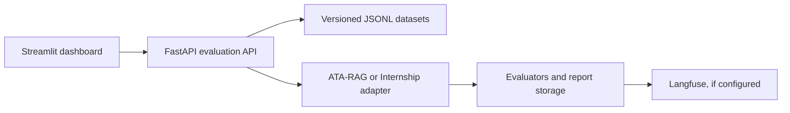

# AI Evaluation Platform

An MVP for repeatable, case level evaluations of ATA-RAG and an Internship Coordinator. Versioned datasets, evaluator settings, outputs, and scores stay together so you can investigate failures and compare runs.

The platform uses a FastAPI evaluation API, Streamlit dashboard, local JSON report storage, and optional Langfuse tracing. Each evaluated application runs as its own service.

## Datasets in this repository

| Application | Dataset ID | Cases | Status |
| --- | --- | ---: | --- |
| ATA-RAG | `ata-rag-golden-v1` | 3 | Small development baseline |
| ATA-RAG | `ata-rag-candidate-100-v1` | 100 | Prompt variants from 20 seed questions; label review pending |
| Internship Coordinator | `internship-coordinator-golden-v1` | 14 | Reviewed development baseline |
| Internship Coordinator | `internship-coordinator-candidate-v2` | 50 | Seven categories; label and behavior review pending |

All four entries are currently marked `released: false` in the manifest.

## What it does

- Runs JSONL datasets through the corresponding application adapter and saves case results.
- Scores exact matches, required fields, latency, retrieval and semantic facts. Internship evaluations can also check security flags and missing field names.
- Shows individual failures, expected and actual outputs, evaluator reasons and aggregate metrics.
- Compares two runs of the same dataset version for score and latency regressions.
- Publishes experiment and case observations to Langfuse when configured.
- Records local human reviews of saved cases; these do not change automated scores.



## Observed development runs

These results were recorded in the project owner's local environment. Saved reports are not committed to Git.

| Dataset | Experiment ID | Result | Notes |
| --- | --- | --- | --- |
| Internship 14 case golden set | `exp-ee904d212eab` | 14/14, 100% | Five evaluator checks passed after reviewing broken PDF labels and the email fallback. |
| Internship 50 case candidate | `exp-ca9ab4c128bc` | 41/50, 82% | Security scored 1.0; nine cases needed review. This run predates a subsequent handwriting extraction fix. |
| ATA-RAG 100 prompt candidate | `exp-bdaa674dcba1` | 92/100, 92% | Four execution failures were recorded. Total application latency: 933,152 ms. |

The ATA-RAG candidate contains five phrasings of **20 seed questions**, not 100 independent topics. Its semantic fact labels do not meaningfully check every answer, so a semantic score of 1.0 does **not** prove perfect factual accuracy. The 50 case Internship set also remains a candidate with unresolved behavioral differences. Do not edit expected labels simply to raise the pass rate. Neither candidate is a released benchmark.

For case level follow up, use **History** in the dashboard and read the [MVP results record](docs/mvp_results.md).

## Run locally on Windows

Use Python 3.12 or 3.13. From the platform project root in PowerShell:

```powershell
py -3.12 -m venv .venv
.\.venv\Scripts\Activate.ps1
python -m pip install -e ".[ui,dev]"
Copy-Item .env.example .env
```

Configure `.env` for the services you plan to evaluate:

| Setting | Purpose |
| --- | --- |
| `ATA_RAG_BASE_URL` | ATA-RAG backend, usually `http://127.0.0.1:8001`. |
| `INTERNSHIP_COORDINATOR_BASE_URL` | Coordinator backend, usually `http://127.0.0.1:8002`. |
| `INTERNSHIP_COORDINATOR_ATTACHMENT_ROOT` | Absolute path to the Coordinator's `generated_test_dataset` folder containing the referenced PDFs. |
| `EVALUATOR_LLM_BASE_URL`, `EVALUATOR_LLM_API_KEY`, `EVALUATOR_LLM_MODEL` | Provider used by the optional `semantic_facts` judge. |
| `LANGFUSE_PUBLIC_KEY`, `LANGFUSE_SECRET_KEY`, `LANGFUSE_HOST` | Optional tracing. |

Do not commit `.env` or credentials. The platform does not start either application backend. For Internship runs, both the evaluation API and the Coordinator need access to the PDF fixtures. ATA-RAG runs require the ATA backend and its provider dependencies.

Start the evaluation API in one terminal:

```powershell
python -m uvicorn app.main:app --reload --host 127.0.0.1 --port 8100
```

Start the dashboard in another:

```powershell
python -m streamlit run dashboard/app.py --server.address 127.0.0.1 --server.port 8501
```

Open [the dashboard](http://127.0.0.1:8501) or [API docs](http://127.0.0.1:8100/docs). `GET /api/v1/health` checks the evaluation API only.

## Try an experiment

1. In **Overview**, confirm the API is online and check Langfuse status if you use tracing.
2. In **Datasets**, select a registered dataset and inspect its inputs and expected outputs.
3. In **Run experiment**, select a dataset, name the run, review the evaluator JSON and click **Run experiment**. Large runs can take several minutes. If the browser times out, check **History** before rerunning.
4. In **History**, inspect failed cases, expected versus actual output, and evaluator reasons. *Failed* on a report means at least one case failed, even when its pass rate is high.
5. In **Compare**, select two experiments of the **same dataset version** and review pass rate, score and latency changes.

Each case in **History** also has a human review form for a reviewer name, judgment, score, pass decision and explanation. Reviews are saved separately under `data/experiments/human_reviews/`. They are not yet linked to Langfuse traces and no reviewer agreement metric is computed.

With Langfuse configured, the API publishes `evaluation-experiment` and `evaluation-case` observations and scores after saving a report. Publication runs in the background and can appear later than the dashboard result. Langfuse dataset synchronization and trace linked human reviews are not implemented.

## Data and API

[`datasets/manifest.json`](datasets/manifest.json) lists JSONL paths, systems, versions, case counts and release states. Reports are saved under `data/experiments/` by default, outside Git.

```powershell
Invoke-RestMethod http://127.0.0.1:8100/api/v1/datasets
Invoke-RestMethod http://127.0.0.1:8100/api/v1/experiments
```

Compare runs with `GET /api/v1/experiments/compare?baseline_id=<id>&candidate_id=<id>`. Use IDs from your own **History** page; the IDs above exist only where those local reports were saved.

## Quality and MVP limits

```powershell
python -m ruff check .
python -m pytest -q
git diff --check
```

This is a local evaluation MVP, not a hosted product. Experiments execute synchronously and save reports when complete, so a long run can outlast the dashboard client timeout. Candidate datasets need independent label review, more diverse ATA-RAG questions, and human assessment of factual responses. CI regression gating, released dataset checksums, and a measured judge versus human agreement study remain future work.

## Repository layout

| Path | Contents |
| --- | --- |
| `app/adapters/` | Application specific request and response adapters. |
| `app/evaluators/` | Deterministic and model assisted evaluators. |
| `app/engine/` | Case and experiment execution. |
| `app/api/` | FastAPI routes and schemas. |
| `dashboard/` | Streamlit interface and API client. |
| `datasets/` | Manifest and JSONL cases. |
| `scripts/` | Dataset building scripts. |
| `tests/` | API, unit and integration tests. |
